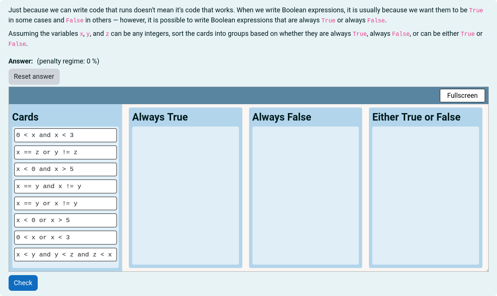

# Card Sort

A card sorting question type.

Students are given a prompt and a set of cards and predefined groups. Students
click and drag cards into groups and are assessed relative to a model answer
card sort.
