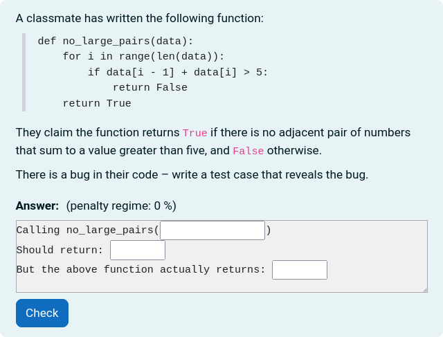

# Refute

This question type is a subtype of the gapfiller question type and is based on
Viraj Kumar's refute question type[^1].

Refute questions present students with code and an incorrect description of what
the code does. Students must then provide a test case that "refutes" the
description by showing a discrepancy between the actual output of the code and
the erroneous description of what the code does.

[^1]: https://dl.acm.org/doi/abs/10.1145/3446871.3469791
